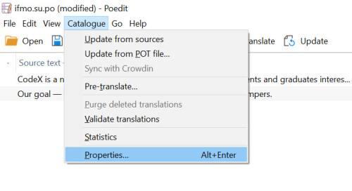
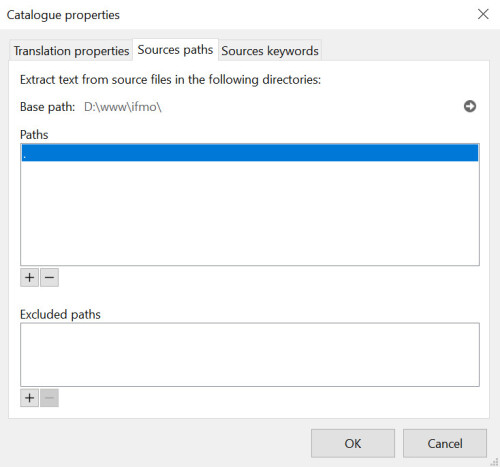

### Adding New Translations
1. Implement gettext functions where needed.
2. Extract them from your code using [Poedit](https://poedit.net) features.

3. Add translations and save your .po file.
4. Poedit will automatically compile .mo file.
